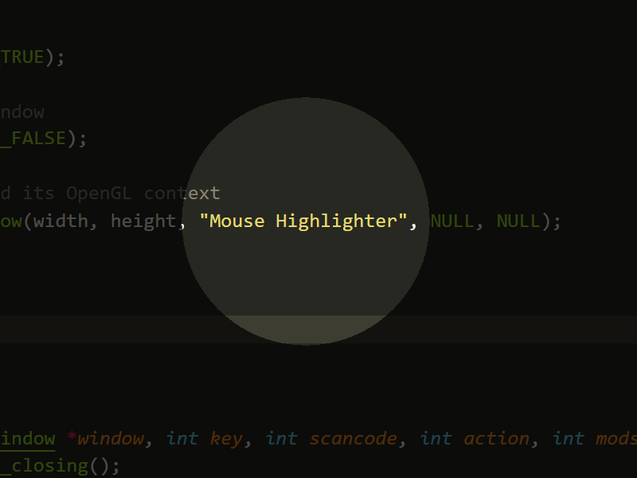

# Mouse Highlighter

A utility to dim the screen and show a spotlight around the mouse cursor.



### Controls
- ```alt+q``` to quit the application
- ```alt+s``` to activate the spotlight
- ```any key or mouse button``` to deactivate the spotlight
- ```mouse wheel``` to change the size of the spotlight